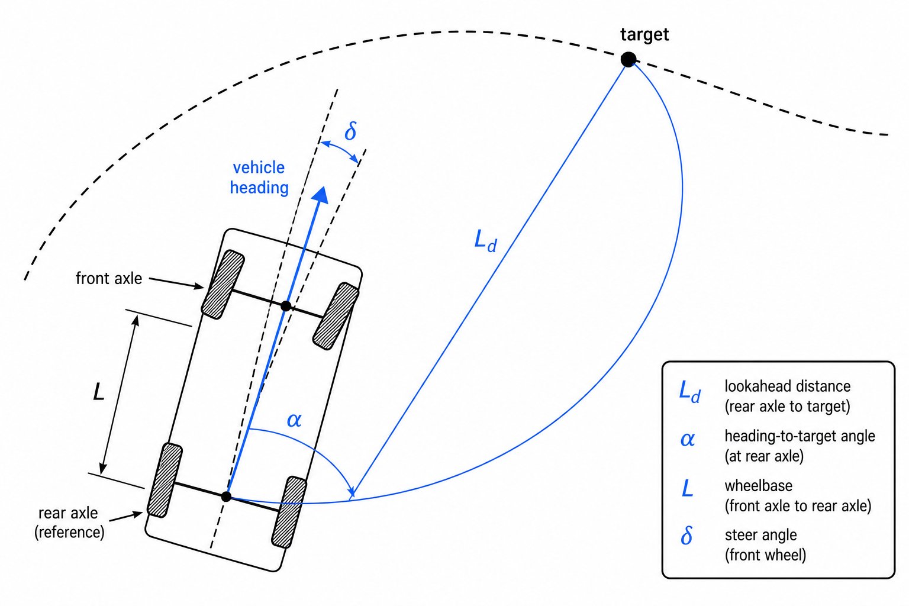

# New member onboarding guide

Welcome. This branch teaches the sim + autonomy stack by **practice**:

1. Get the simulator running.  
2. Learn ROS with small packages under `onboarding/exercises/`.  
3. For perception / planning / control: do a **toy exercise**, then fill the matching **`STUDENT TODO` in `pipeline/`**.

Do not peek at `onboarding/solutions/` until you pass the exercise or your mentor says so. Pipeline answers live on production `dev` — ask before diffing.

**Expected time:** ~1–2 half-days for this introductory track.

---

## 0. Checkout and setup

```bash
git clone <ifs-onboarding-url>
cd ifs-onboarding
```

Follow **[SETUP.md](../SETUP.md)**: download a **pre-built IFSSIM release**
(not the Unreal source tree), then `docker compose build && docker compose up -d`.
Confirm Mission Control at http://localhost:3000 can start a session against
the running sim binary.

---

## ROS theory (read before the ROS exercises)

ROS 2 (Robot Operating System) is the middleware our car and sim share. You will not memorize every API — you need the mental model.

### Node

A **node** is one running program on the ROS graph. It has a name (`cone_detection_node`, `control_node`, …), can log, declare parameters, and create publishers / subscribers / services / timers.

In Python you subclass `rclpy.node.Node`, call `super().__init__("my_name")`, then `rclpy.spin(node)` so callbacks keep firing until you shut down.

### Package

A **package** is the installable unit that contains one or more nodes (and maybe messages, launch files, libraries). Identified by `package.xml`. You build with `colcon` and run with `ros2 run <package> <executable>`.

### Topic, publisher, subscriber

Nodes rarely call each other like normal functions. They **publish** typed messages on named **topics**; other nodes **subscribe** and get a callback when a message arrives.

```text
[ talker ] --String-->  topic "onboarding/chatter"  --String--> [ listener ]
```

- **Publisher:** “I produce messages of type T on topic X.”  
- **Subscriber:** “When something publishes T on X, run my callback.”  
- Many nodes can publish or subscribe to the same topic.  
- Topics are anonymous buses — the publisher does not know who is listening.

Message types live in packages like `std_msgs`, `geometry_msgs`, `sensor_msgs`, or our custom `dv_msgs` / `fs_msgs`.

### Timer

A timer is a callback on a fixed period (e.g. 1 Hz). Useful for periodic publish when you are not driven by an incoming sensor message.

### Parameter

A named config value on a node (`min_range`, gains, topic remaps at launch, …). Set from the command line, a YAML file, or launch. Prefer parameters over hard-coded constants for tunables.

### Lifecycle node (used heavily in our pipeline)

A normal node is either up or dead. A **lifecycle node** has an explicit state machine so Mission Control / `mode_manager` can bring the stack up in order and pause it cleanly:

Typical states: **Unconfigured → Inactive → Active** (plus cleanup / shutdown paths).

| Transition | Typical work |
|------------|----------------|
| `on_configure` | Allocate publishers, load models, Numba warmup — expensive setup |
| `on_activate` | Start subscriptions / timers — begin processing |
| `on_deactivate` | Stop subscriptions — pause without tearing everything down |
| `on_cleanup` | Destroy pubs/subs, free resources |

Our autonomy nodes (`cone_detection`, `slam`, `path_planning`, `control`, …) are lifecycle nodes. That is why Phase B asks for **lifecycle publishers** and why the LiDAR subscription is created in `on_activate`, not in `__init__`.

You do **not** need to implement a lifecycle node in the toys — just understand why the real pipeline looks different from `Talker(Node)`.

### QoS (brief)

Quality of Service settings control queue depth, reliability, durability. Sensor streams often use “best effort / keep last”; commands may use reliable. The pipeline already picks QoS profiles for you — copy the profile used next to the subscription you are restoring.

---

## 1. Create a ROS package

[`exercises/01_create_package/`](exercises/01_create_package/) — follow its README.

Fill `package.xml`, `setup.py` entry point, and `hello_node.py`. Build and `ros2 run hello_onboarding hello`.

---

## 2. Publishers and subscribers

[`exercises/02_ros_pubsub/`](exercises/02_ros_pubsub/)

Complete the TODOs in `talker.py` and `listener.py` (hints describe *what*, not the exact one-liner).

```bash
ros2 run ros_pubsub_exercise talker      # terminal 1
ros2 run ros_pubsub_exercise listener    # terminal 2
```

You should see `hello N` messages. Use `ros2 topic list` / `ros2 topic echo /onboarding/chatter` to inspect the graph.

---

## 3. Distance filter (pub + sub + parameter)

[`exercises/03_ros_distance_filter/`](exercises/03_ros_distance_filter/) — see its README.

One node: subscribe to points, always publish distance, forward the point only if it is far enough (`min_range` parameter).

---

## 3b. Phase B — wire cone detection I/O

Open [`pipeline/cone_detection/cone_detection/cone_detection_node.py`](../pipeline/cone_detection/cone_detection/cone_detection_node.py).

Restore:

- lifecycle publishers for `Conos_raw` and `Conos_Orange` in `on_configure`  
- the LiDAR subscription in `on_activate`  

After Docker refresh, cones appear once perception maths below are filled.

---

## 4. Plane from three points

Any three non-colinear points define a plane. You will need that as the **hypothesis** step inside RANSAC.

### Phase A

```bash
cd onboarding/exercises/04_plane_from_3_points
pytest -q
```

Implement `plane_from_points` in `plane.py`.

### Phase B

Used inside the RANSAC blank in the next section.

---

## 5. RANSAC ground plane

### Why RANSAC here?

A LiDAR scan is mostly **ground**, plus cones, fences, noise. Before clustering cones we want to throw away ground points. Fitting a plane with least squares on the whole cloud fails when outliers (cars, walls, cones) pull the fit.

**RANSAC** (Random Sample Consensus) is a robust fitting pattern:

1. **Sample** the smallest set that defines the model (here: 3 points → a plane).  
2. **Score** how many other points lie close to that model (**inliers** within a residual threshold).  
3. **Repeat** many times; keep the model with the most support.  
4. Optionally refine using all inliers (production code focuses on the consensus loop + warm-start from the previous scan).

Why it fits FS LiDAR: most points really are ground → a good plane quickly gets huge support; cones and walls are outliers and do not dominate the vote. That is why cone detection runs RANSAC **before** DBSCAN clustering.

### Phase A

```bash
# Finish exercise 04 first (imported by mini RANSAC).
cd onboarding/exercises/05_mini_ransac
pytest -q
```

### Phase B

Open [`pipeline/cone_detection/cone_detection/ransac.py`](../pipeline/cone_detection/cone_detection/ransac.py).

In the main loop, replace the `STUDENT TODO` with the plane hypothesis + inlier count (keep names `coefs` and `support_aux`). Delete the placeholders and the `raise`.

Leave warm-start, subsample, and adaptive iteration budget alone — read them; they are production hardening around the same idea you just implemented.

---

## 6. Path planning (intro)

### Phase A

```bash
cd onboarding/exercises/06_midpoint_path
pytest -q
```

Implement `world_to_body` and `midpoint_path`. Production planning uses **FaSTTUBe**; midpoints are geometric intuition only.

### Phase B

Fill TODOs in:

- [`pipeline/path_planning/path_planning/core_types.py`](../pipeline/path_planning/path_planning/core_types.py) — `world_to_body`  
- [`pipeline/path_planning/path_planning/fasttube_adapter.py`](../pipeline/path_planning/path_planning/fasttube_adapter.py) — `_cull_cones`  

```bash
cd pipeline/path_planning
pytest -q test/test_fasttube_adapter.py
```

(Needs package deps / `fsd_path_planning` as in your usual pipeline test setup.)

---

## 7. Pure Pursuit (intro)

Pure Pursuit picks a **lookahead** point on the path ahead of the car and steers so the vehicle would follow an arc through that point.



| Symbol | Meaning |
|--------|---------|
| **Ld** | Lookahead distance — how far ahead on the path we chase |
| **α** (alpha) | Angle from the vehicle heading to the line toward the target |
| **L** | Wheelbase — distance between rear and front axle |
| **δ** (delta) | Front-wheel steering angle commanded to track the arc |

Curvature of the chase arc and steer (bicycle model):

\[
\kappa = \frac{2\sin\alpha}{L_d},\quad \delta = \arctan(L\cdot\kappa)
\]

We then normalize δ by the max steer angle into `[-1, 1]` for the sim/car interface.

### Phase A

```bash
cd onboarding/exercises/07_pure_pursuit
pytest -q
```

### Phase B

Open [`pipeline/control/control/controllers/pure_pursuit.py`](../pipeline/control/control/controllers/pure_pursuit.py).

Restore the curvature + steer return at the `STUDENT TODO`. Adaptive lookahead above the blank stays as-is.

```bash
cd pipeline/control
pytest -q test/test_pure_pursuit.py
```

---

## 8. Bring it up live

With TODOs filled:

1. Refresh / restart the Docker stack (`tools/refresh-bridge.sh` or recreate containers).  
2. Start the pre-built sim + Mission Control session.  
3. Watch `/Conos_raw`, `/Path`, and steering in Lichtblick / Mission Control.

If something is silent, check for a leftover `NotImplementedError` in a TODO.

---

## What this track does **not** cover yet

EKF odometry, cone-graph SLAM / GTSAM, FaSTTUBe internals, mission / AS state machine. Ask for a follow-up track when you are ready.

---

## Further reading (after the exercises)

Upstream IFSSIM docs (no need to clone that repo — open on GitHub):

- [ARCHITECTURE.md](https://github.com/isc-fs/IFSSIM/blob/dev/docs/ARCHITECTURE.md) — sim vs car node / topic graph  
- [AUTONOMY.md](https://github.com/isc-fs/IFSSIM/blob/dev/docs/AUTONOMY.md) — ownership / integration contract  
- [REFERENCE.md](https://github.com/isc-fs/IFSSIM/blob/dev/docs/REFERENCE.md) — sensors, frames, RPC  

In this repo:

- [pipeline/bringup/bringup/topic_contract.py](../pipeline/bringup/bringup/topic_contract.py) — remaps pinned for launch  

Optional whiteboard check: sketch LiDAR → cone detection → SLAM → path planning → control → actuators and label one topic on each arrow.

---

*ISC Racing Team — IFSSIM onboarding*
